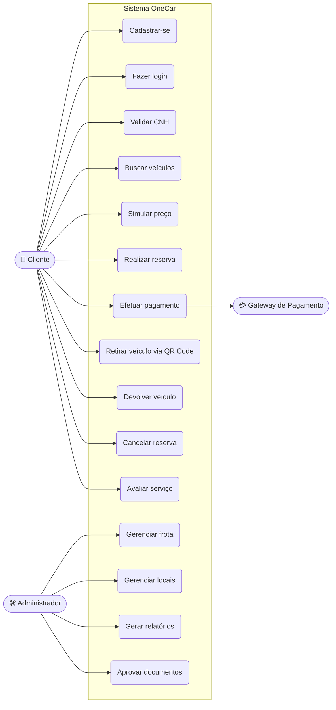
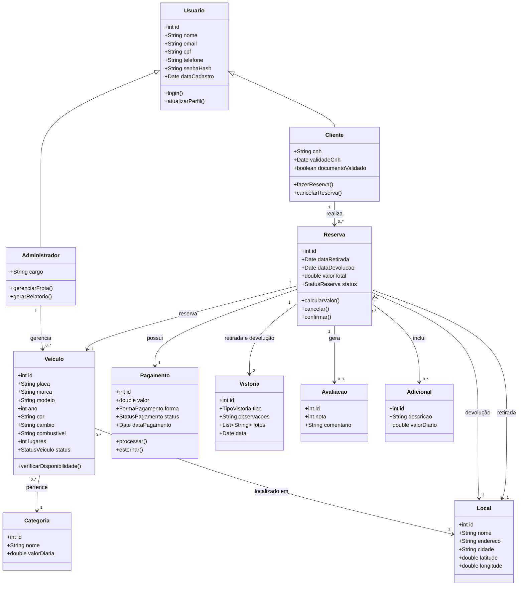
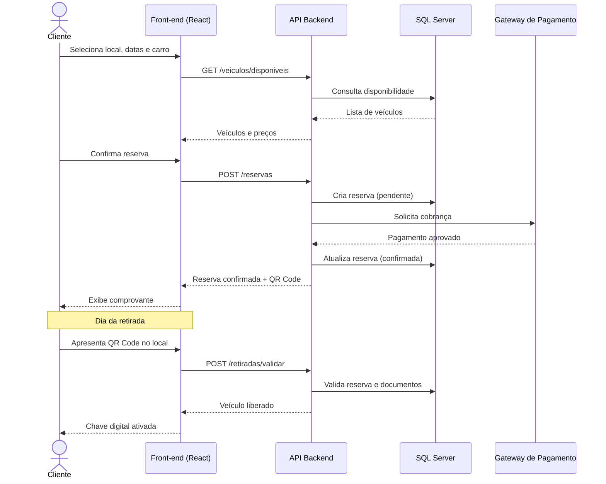
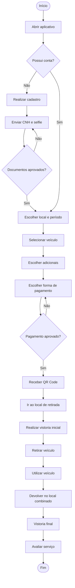
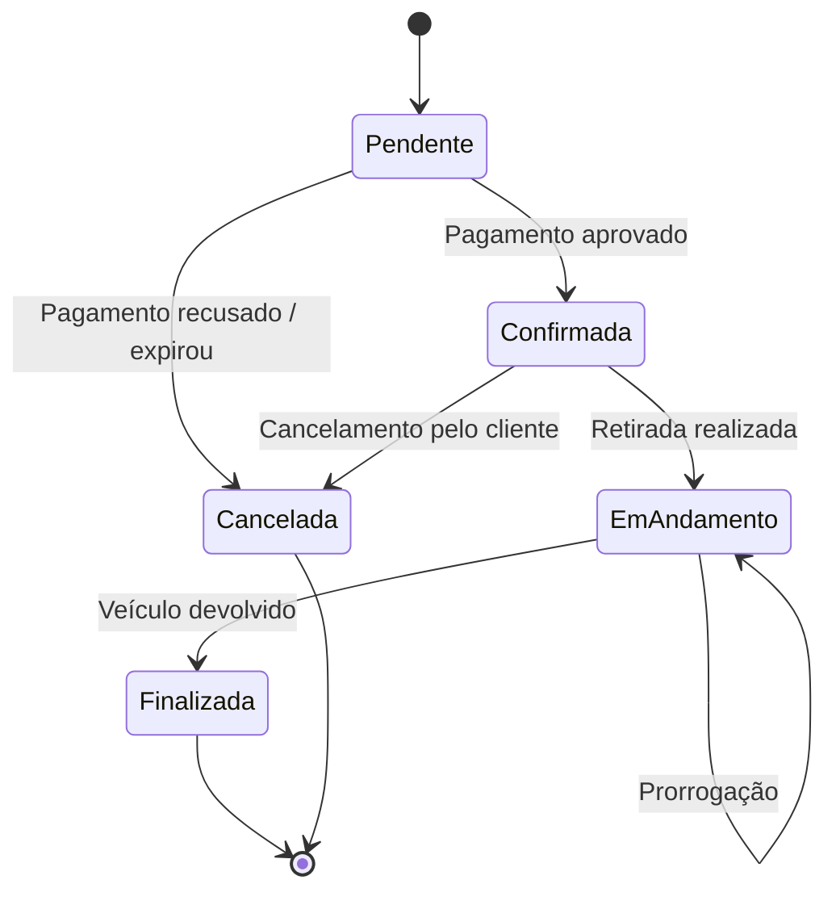
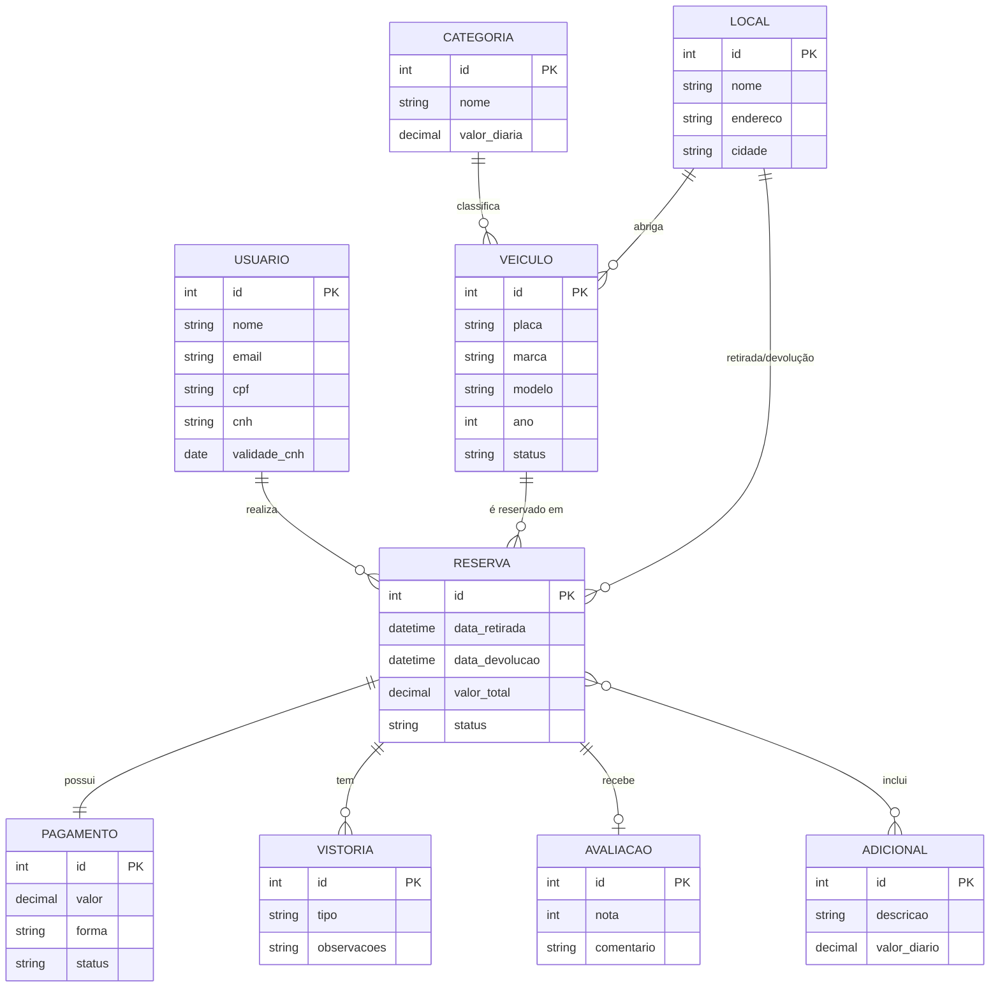
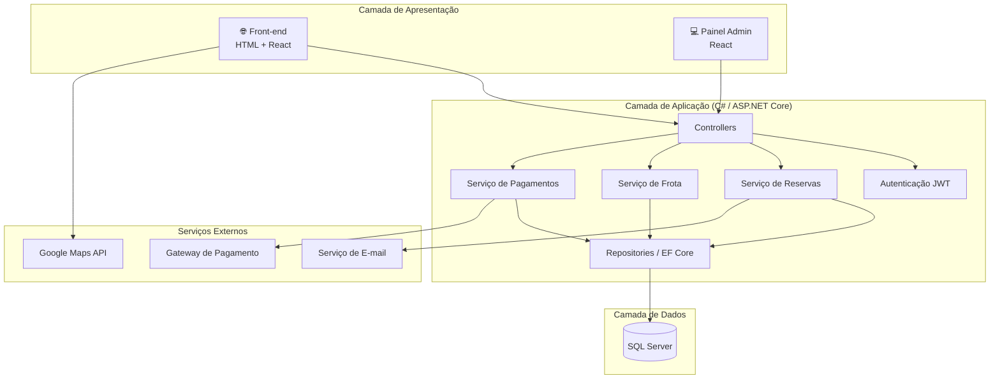

<div align="center">

# 🚗 OneCar — Aluguel de Carros 100% Digital

**Escolha o carro, defina o período, pague pelo app e retire no local combinado. Sem fila, sem atendente, sem burocracia.**


[Sobre](#-sobre-o-projeto) •
[Funcionalidades](#-funcionalidades) •
[Telas](#-telas-do-sistema) •
[UML](#-diagramas-uml) •
[Stack](#-stack-de-tecnologia) •
[Instalação](#-como-executar) •
[API](#-documentação-da-api) •
[Contribuição](#-como-contribuir)

</div>

---

## 📑 Sumário

- [Sobre o projeto](#-sobre-o-projeto)
- [Problema e solução](#-problema-e-solução)
- [Funcionalidades](#-funcionalidades)
- [Telas do sistema](#-telas-do-sistema)
- [Diagramas UML](#-diagramas-uml)
- [Stack de tecnologia](#-stack-de-tecnologia)
- [Arquitetura](#-arquitetura)
- [Estrutura de pastas](#-estrutura-de-pastas)
- [Como executar](#-como-executar)
- [Configuração](#-configuração-appsettingsjson)
- [Documentação da API](#-documentação-da-api)
- [Testes](#-testes)
- [Roadmap](#-roadmap)
- [Como contribuir](#-como-contribuir)
- [Equipe](#-equipe)

---

## 📖 Sobre o projeto

O **OneCar** é uma plataforma de aluguel de veículos totalmente digital, inspirada nas grandes locadoras do mercado. Todo o processo acontece pelo aplicativo: o cliente escolhe o carro, define o período de locação, seleciona a forma de pagamento e retira o veículo em um ponto pré-definido (como aeroportos, rodoviárias e estações), **sem a necessidade de um atendente**.

O projeto foi desenvolvido com foco em **simplicidade, segurança e praticidade**, entregando a experiência essencial de qualquer locadora: reservar, pagar, retirar e devolver.

## 🎯 Problema e solução

| Problema | Solução |
|---|---|
| Filas e demora no balcão de atendimento | Reserva e contrato 100% pelo app |
| Custos altos com equipe de atendimento | Processo automatizado e autoatendimento |
| Falta de transparência no valor final | Cálculo de preço em tempo real, antes de confirmar |
| Horário de atendimento limitado | Disponibilidade 24h por dia, 7 dias por semana |
| Burocracia na retirada do carro | Retirada com QR Code e verificação de documentos digital |

---

## ✨ Funcionalidades

### 👤 Cliente
- Cadastro e login (e-mail, Google e Apple)
- Validação de CNH e documento com foto
- Busca de veículos por categoria, preço, câmbio e disponibilidade
- Filtro por local de retirada e devolução
- Simulação de preço por período
- Pagamento via **Pix, cartão de crédito, cartão de débito e boleto**
- Retirada do veículo por **QR Code / chave digital**
- Histórico de reservas e recibos
- Cancelamento e alteração de reserva
- Avaliação do veículo e do serviço
- Notificações push (confirmação, lembrete de retirada e devolução)

### 🛠️ Administrador
- Painel de gestão de frota
- Cadastro, edição e inativação de veículos
- Gestão de locais de retirada
- Controle de reservas e pagamentos
- Relatórios financeiros e de ocupação
- Gestão de usuários e documentos pendentes

### 🔒 Segurança
- Autenticação JWT com refresh token
- Criptografia de senhas com bcrypt
- Comunicação via HTTPS
- Conformidade com a **LGPD**

---

## 📱 Telas do sistema

> 🎨 **Protótipo no Figma:** [Acessar o projeto no Figma](https://www.figma.com/make/FnvCQsR5EpgN7rVIO6MUkh/Self-Service-Car-Rental-App?code-node-id=0-6&p=f&t=8gZEzMsdANiZ9oQ8-0&fullscreen=1)

> 🚧 O projeto está em fase inicial de desenvolvimento. As telas abaixo serão atualizadas conforme o sistema evoluir.

| Tela inicial | Escolha do veículo |
|:---:|:---:|
|  |  |
| Busca de local, datas e acesso rápido às reservas | Lista de carros disponíveis com preço e categoria |

| Pagamento | Aluguel em andamento |
|:---:|:---:|
|  |  |
| Escolha da forma de pagamento (Pix, cartão ou ApplePay) | Detalhes da locação ativa, prazo e devolução |

---

## 📐 Diagramas UML

Os diagramas abaixo são escritos em **Mermaid** e renderizam automaticamente no GitHub.

### 1. Diagrama de Casos de Uso



### 2. Diagrama de Classes



### 3. Diagrama de Sequência — Reserva e Retirada



### 4. Diagrama de Atividades — Fluxo de Locação



### 5. Diagrama de Estados — Reserva



### 6. Diagrama Entidade-Relacionamento (DER)



### 7. Diagrama de Componentes



---

## 🛠️ Stack de tecnologia

### Front-end
| Tecnologia | Uso |
|---|---|
| **HTML5** | Estrutura das páginas |
| **CSS3** | Estilização e responsividade |
| **JavaScript** | Interações e regras de interface |
| **React** | Componentes e telas (código gerado a partir do Figma) |
| **Figma** | Protótipos, design system e geração das telas |
| **Axios / Fetch API** | Consumo da API |

### Back-end
| Tecnologia | Uso |
|---|---|
| **C#** | Linguagem principal do servidor |
| **.NET / ASP.NET Core Web API** | API REST |
| **Entity Framework Core** | ORM e acesso ao banco de dados |
| **JWT** | Autenticação e autorização |
| **BCrypt** | Criptografia de senhas |
| **Swagger (Swashbuckle)** | Documentação da API |
| **xUnit** + **Moq** | Testes automatizados |

### Banco de dados
| Tecnologia | Uso |
|---|---|
| **Microsoft SQL Server** | Banco de dados relacional |
| **SQL Server Management Studio (SSMS)** | Administração e consultas |
| **EF Core Migrations** | Versionamento do banco |

### Infraestrutura e ferramentas
| Tecnologia | Uso |
|---|---|
| **Docker** + **Docker Compose** | Containerização |
| **GitHub Actions** | CI/CD |
| **Git / GitHub** | Versionamento de código |
| **Visual Studio / VS Code** | Ambiente de desenvolvimento |

### Integrações
- 💳 **Gateway de pagamento** (Pix, cartão e boleto)
- 🗺️ **Google Maps API** — localização e rotas
- ✉️ **Serviço de e-mail (SMTP / SendGrid)** — e-mails transacionais

### Design e documentação
- 🎨 **Figma** — protótipos e design system
- 📐 **Mermaid** — diagramas UML

---

## 🏗️ Arquitetura

O sistema segue uma arquitetura em camadas (**Controller → Service → Repository**), com uma API REST em C# consumida pelo front-end web (HTML e React).

```
┌───────────────────────────┐
│  Front-end (HTML + React) │
└─────────────┬─────────────┘
              ▼
      ┌───────────────┐
      │  API REST C#  │
      │ (ASP.NET Core)│
      └───────┬───────┘
              ▼
      ┌───────────────┐
      │  SQL Server   │
      └───────────────┘
```

---

## 📂 Estrutura de pastas

```
onecar/
├── 📁 frontend/              # HTML + React (gerado do Figma)
│   ├── public/
│   ├── src/
│   │   ├── assets/
│   │   ├── components/
│   │   ├── pages/
│   │   ├── services/
│   │   └── styles/
│   └── package.json
├── 📁 backend/               # API em C# (.NET)
│   ├── OneCar.API/           # Controllers, Program.cs
│   ├── OneCar.Application/   # Services e regras de negócio
│   ├── OneCar.Domain/        # Entidades e interfaces
│   ├── OneCar.Infrastructure/# EF Core, repositórios, migrations
│   ├── OneCar.Tests/         # Testes com xUnit
│   └── OneCar.sln
├── 📁 database/              # Scripts SQL (criação e seed)
├── 📁 docs/
│   ├── screens/              # Prints das telas
│   └── uml/                  # Diagramas
├── 📄 docker-compose.yml
├── 📄 LICENSE
└── 📄 README.md
```

---

## 🚀 Como executar
ATENÇÃO AREA EM DESENVOLVIMENTO
### Pré-requisitos

- [.NET SDK](https://dotnet.microsoft.com/download) 8.0 ou superior
- [SQL Server](https://www.microsoft.com/sql-server) (local, Express ou via Docker)
- [Node.js](https://nodejs.org/) 18 ou superior (para o front-end React)
- [Git](https://git-scm.com/)
- Opcional: [Docker](https://www.docker.com/)

### Passo a passo

```bash
# 1. Clone o repositório
git clone https://github.com/seu-usuario/onecar.git
cd onecar

# 2. (Opcional) Suba o SQL Server com Docker
docker-compose up -d

# 3. Configure a string de conexão em backend/OneCar.API/appsettings.json

# 4. Rode o back-end
cd backend
dotnet restore
dotnet ef database update --project OneCar.Infrastructure --startup-project OneCar.API
dotnet run --project OneCar.API

# 5. Em outro terminal, rode o front-end
cd frontend
npm install
npm start
```

A API estará disponível em `https://localhost:5001` e a documentação Swagger em `https://localhost:5001/swagger`.

---

## 🔐 Configuração (appsettings.json)

```json
{
  "ConnectionStrings": {
    "DefaultConnection": "Server=localhost,1433;Database=OneCar;User Id=sa;Password=SuaSenhaForte123;TrustServerCertificate=True"
  },
  "Jwt": {
    "Key": "sua_chave_secreta_com_32_caracteres_ou_mais",
    "Issuer": "OneCar",
    "Audience": "OneCarUsers",
    "ExpiresInMinutes": 60
  },
  "Payment": {
    "ApiKey": "sua_chave_do_gateway"
  },
  "GoogleMaps": {
    "ApiKey": "sua_chave_do_google"
  },
  "Email": {
    "Smtp": "smtp.exemplo.com",
    "User": "contato@onecar.com",
    "Password": "sua_senha"
  }
}
```

> ⚠️ Nunca suba chaves e senhas reais para o GitHub. Use *User Secrets* ou variáveis de ambiente.

---

## 📡 Documentação da API

### Principais endpoints

| Método | Rota | Descrição |
|:---:|---|---|
| `POST` | `/auth/register` | Cadastro de usuário |
| `POST` | `/auth/login` | Login e geração de token |
| `GET` | `/users/me` | Dados do usuário logado |
| `POST` | `/users/me/documents` | Envio de CNH e selfie |
| `GET` | `/locations` | Lista de locais de retirada |
| `GET` | `/vehicles` | Lista de veículos disponíveis |
| `GET` | `/vehicles/:id` | Detalhes do veículo |
| `POST` | `/reservations/quote` | Simulação de preço |
| `POST` | `/reservations` | Criar reserva |
| `GET` | `/reservations` | Histórico de reservas |
| `PATCH` | `/reservations/:id/cancel` | Cancelar reserva |
| `POST` | `/reservations/:id/pickup` | Validar retirada (QR Code) |
| `POST` | `/reservations/:id/return` | Registrar devolução |
| `POST` | `/payments` | Processar pagamento |
| `POST` | `/reviews` | Avaliar locação |

### Exemplo de requisição

```http
POST /reservations
Authorization: Bearer <token>
Content-Type: application/json

{
  "vehicleId": 12,
  "pickupLocationId": 1,
  "returnLocationId": 1,
  "pickupDate": "2026-11-10T10:00:00Z",
  "returnDate": "2026-11-15T10:00:00Z",
  "paymentMethod": "PIX"
}
```

```json
{
  "id": 481,
  "status": "PENDING",
  "totalAmount": 1250.00,
  "qrCode": "data:image/png;base64,..."
}
```

A documentação completa (Swagger) fica em `/swagger`.

---

## 🧪 Testes

```bash
# Executar todos os testes (xUnit)
dotnet test

# Com cobertura
dotnet test --collect:"XPlat Code Coverage"
```

---

## 🗺️ Roadmap

- [x] Cadastro e autenticação de usuários
- [x] Busca e filtro de veículos
- [x] Reserva e pagamento
- [x] Retirada por QR Code
- [x] Painel administrativo
- [ ] Chave digital via Bluetooth
- [ ] Programa de fidelidade e pontos
- [ ] Assinatura mensal de veículos
- [ ] Suporte a carros elétricos
- [ ] Chat de suporte dentro do app
- [ ] Aplicativo mobile nativo
- [ ] Versão em inglês e espanhol

---

## 🤝 Como contribuir

Contribuições são muito bem-vindas!

1. Faça um **fork** do projeto
2. Crie uma branch para a sua feature (`git checkout -b feature/minha-feature`)
3. Faça o commit das alterações (`git commit -m 'feat: adiciona minha feature'`)
4. Envie para a branch (`git push origin feature/minha-feature`)
5. Abra um **Pull Request**

Seguimos o padrão [Conventional Commits](https://www.conventionalcommits.org/pt-br/).

---

## 👥 Equipe

| Nome | Função | GitHub |
|---|---|---|
| Rafael | Desenvolvedor Full Stack | [@rafael](https://github.com/Rafael-santiago-silva) |
| Rafael | UI/UX Designer | [@rafael](https://github.com/Rafael-santiago-silva) |
| Rafael | Back-end | [@rafael](https://github.com/Rafael-santiago-silva) |

---

---

<div align="center">

Feito com 💙 por **Equipe OneCar**

⭐ Se este projeto te ajudou, deixe uma estrela!

</div>
